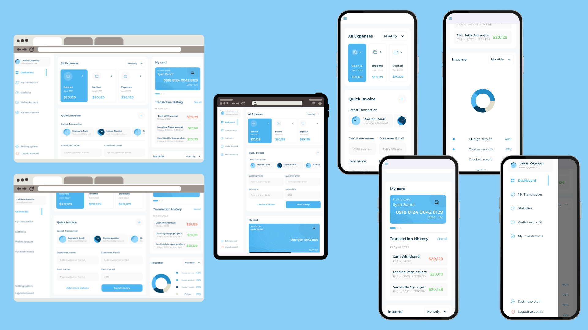

# 📊 Responsive Dashboard – Flutter Web, Tablet & Mobile

A **fully responsive Flutter dashboard** designed to work seamlessly across **Web, Tablet, and Mobile** platforms.  
This project focuses on **clean UI**, **adaptive layouts**, and **interactive components** following modern dashboard design principles.


---

## ✨ Features

- 📱 **Fully Responsive Design**
  - Optimized layouts for **Web**, **Tablet**, and **Mobile**
  - Smooth layout transitions based on screen size

- 🧭 **Interactive Sidebar**
  - Clickable navigation items
  - **Active & inactive states** with clear visual feedback
  - Adaptive behavior for small screens

- 💰 **All Expenses Section**
  - Interactive expense cards
  - Different UI states for **active / inactive items**

- 🔤 **Responsive Typography**
  - Font sizes scale based on screen size
  - Consistent typography using **Montserrat**

- 📈 **Charts & Analytics**
  - Clean and modern charts using `fl_chart`
  - Income and expense visualizations

- 🧪 **Device Preview Support**
  - Preview multiple devices without rebuilding

---

## 🖥️ Supported Platforms

| Platform | Supported |
|--------|-----------|
| 🌐 Web | ✅ |
| 📱 Mobile | ✅ |
| 💊 Tablet | ✅ |

---
## 🗂️ Project Structure

```text
assets/
├── font/                   # Custom fonts (Montserrat)
├── images/                 # UI images and icons
└── screenshot/
    └── preview.png         # Dashboard preview image

lib/
├── core/
│   ├── theme/              # App themes, colors, and text styles
│   └── utils/              # Utilities and constants
│
├── model/                  # Data models
│
├── view/
│   └── dash_board_view.dart   # Main dashboard screen
│
├── widgets/                # Reusable UI components
│
└── main.dart               # Application entry point

```
---
## 📦 Dependencies

```yaml
dependencies:
  flutter:
    sdk: flutter
  cupertino_icons: ^1.0.8
  device_preview: ^1.2.0
  expandable_page_view: ^1.2.0
  fl_chart: ^0.71.0
```

## 🎨 Fonts & Assets

- **Font Family:** Montserrat  
- **Assets Directory:** `assets/images/`  
- **Fonts Directory:** `assets/font/`

All assets and fonts are properly configured in `pubspec.yaml` to ensure responsiveness and performance.

---

## 🚀 Getting Started

### 1️⃣ Clone the Repository
```bash
git clone https://github.com/your-username/responsive_dashboard_flutter.git
```
### 2️⃣ Install Dependencies
```bash
flutter pub get
```
### 3️⃣ Run the Project
```bash
flutter run -d chrome
```

---
## 🧠 Design Principles

- Responsive UI using `LayoutBuilder` & `MediaQuery`
- Reusable and scalable widgets
- Clean folder architecture
- Platform-adaptive navigation
- Separation of concerns

---

## 🛠️ Built With

- Flutter SDK **3.6.1**
- Dart
- Material Design
- `fl_chart`
- `device_preview`

---

## 📌 Use Cases

- Admin Dashboards  
- Finance & Invoice Systems  
- Analytics Panels  
- Portfolio UI Projects  

---

## 👩‍💻 Author

**Yomna Abdelmegeed**  
Flutter Developer & Computer Science Student  

- 📱 Specialized in Flutter development
